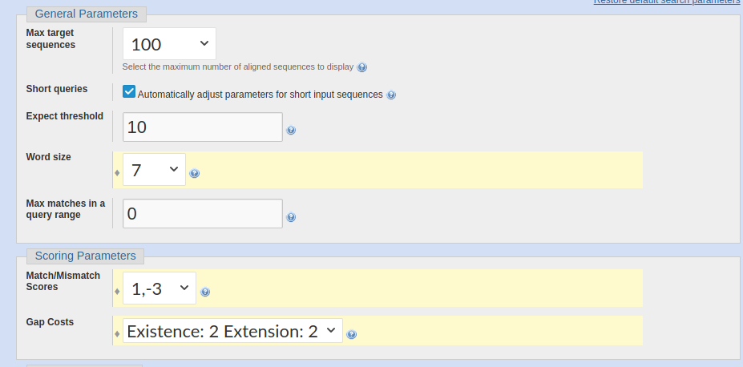
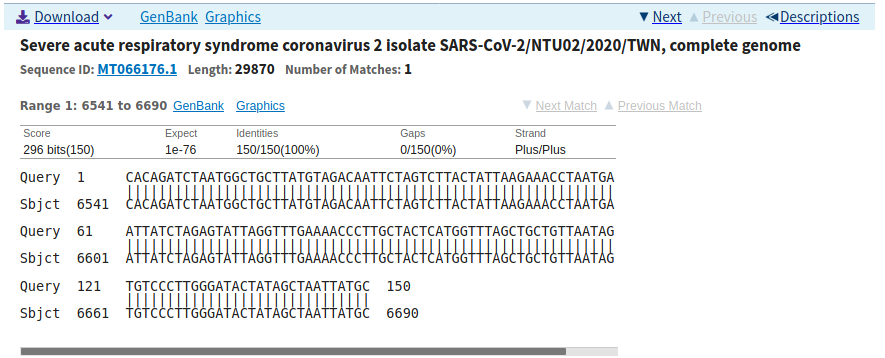
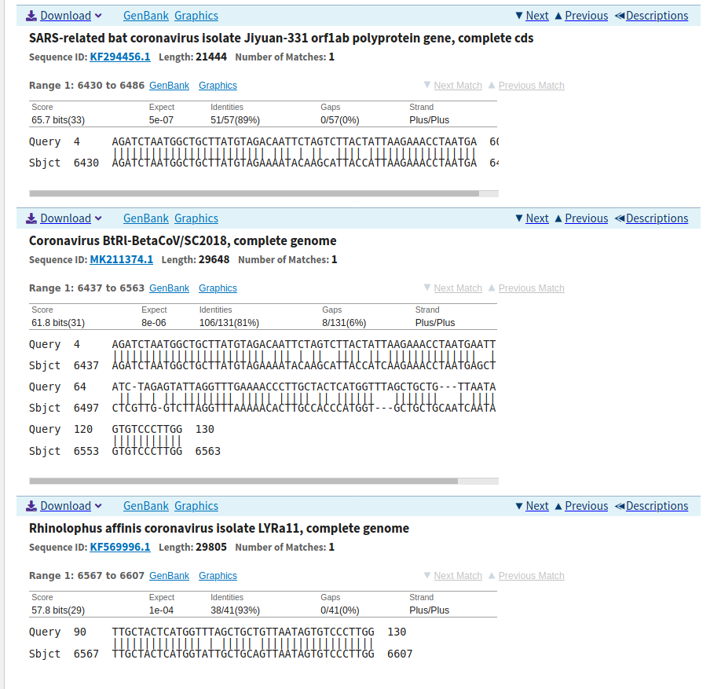
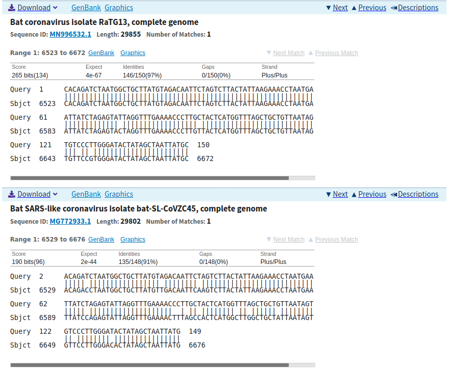

I discussed the problems with Jason Mohabir and Harry Lee.


# Problem 1

\noindent a. The following sequence taken from the Wuhan-Hu-1 sequence from position 6541 to 6690

    >my_sequence
    cacagatctaatggctgcttatgtagacaattctagtcttactattaagaaacctaatgaattatctagagtattaggtttgaaaacc
    cttgctactcatggtttagctgctgttaatagtgtcccttgggatactatagctaattatgc
    
\noindent b.


In order to encourage alignments with gaps for problem 2d to be interesting, scoring parameters that penalized gap openings less were used.




As expected, the sequence aligns perfectly with itself.


The sequence aligns with another corona virus in a similar position (6437 vs 6541). Notably, there's a single deletion and single insertion, as well as a deletion of length 3 and an insertion of length 3, which suggests that these code for similar proteins as well, as the coding frame is largely preserved.



The sequence also aligns with bat coronaviruses, in a similar positions. This makes sense given the recent reporting that the Wuhan virus may have spread to humans from bats.

\noindent c. From these results, I learned that the Wuhan virus is extremely similar to other corona viruses in its coding sequence, in that this coding region appears in a similar location compared to other corona viruses, and the coding frame seems to be the same across different sequences. The statistical significance of the BLAST output also seems to be extremely high, given many expected values are in the order of $10^{-6}$ to $10^{-8}$, and the total length of the virus is roughly $3 \times 10^{5}$ bases long. It seems that the algorithm for generating the expected value puts significantly higher emphasis on matches and mismatches over indels, as very few alignments included gaps, even though several alignments of about 80% matches still achieved low expected values.

\newpage

# Problem 2

\noindent a. Penalizing gaps of lengths that are multiples of 3 makes sense from a biological standpoint, because it reflects that mutations that cause such gaps are more likely to result in functional proteins. A deletion or insertion of a single or two bases would be a nonsense mutation, in that the coding frame is shifted and a entirely different protein would be formed from the new amino acid sequence. Importantly, the stop codon would moved out of frame, meaning a new stop codon may be either significantly earlier or later in the sequence. However, a deletion or insertion of 3 or a multiple of 3 bases would not shift the reading frame, and all unaffected codons would stay the same. This would result in a protein that is likely able to function similarly to the original protein, or at least not result in a complete non-functional protein, and the organism would be more likely to survive and pass along the mutation.

\noindent b & c. My implementation of the dynamic programming algorithm for scoring the alignment matrix, as well as the traceback protocol.

```{python}
import numpy as np

# Returns the total cost of a gap of length gap_len
def init_cost(gap_len):
    return gap_len + 2 + gap_len % 3

# Returns marginal cost between gap_len and gap_len - 1
def add_cost(gap_len):
    return 4 if gap_len == 1 else -1 if gap_len % 3 == 0 else 2

# Returns the marginal cost of a match/mismatch
def match_cost(match): return -1 if match else 1

# Returns a 3-dimensional tensor with rows corresponding to the query, 
# columns corresponding to the reference, and a data vector
def make_cost_array(query, ref):
    query_len = len(query)
    ref_len = len(ref)

    # Each point of matrix is match cost, delete cost, 
    # insert cost, delete gap length, insert gap length

    cost_array = np.zeros((query_len + 1, ref_len + 1, 5))

    cost_array[:, 0] =\
      [[np.inf, init_cost(i), np.inf, i, 0] for i in range(query_len + 1)]
    cost_array[0, :] =\
      [[np.inf, np.inf, init_cost(i), 0, i] for i in range(ref_len + 1)]
    cost_array[0, 0] = [0, np.inf, np.inf, 0, 0]

    for r in range(query_len):
        for c in range(ref_len):
            match_from = cost_array[r, c, 0:3]
            cost_array[r + 1, c + 1, 0] =\
              match_cost(query[r] == ref[c]) + min(match_from)

            ins_from = cost_array[r, c + 1]
            ins_cost = min(\
              ins_from[0] + add_cost(1),\
              ins_from[2] + add_cost(1),\
              ins_from[1] + add_cost(ins_from[3] + 1)\
            )
            cost_array[r + 1, c + 1, 1] = ins_cost
            cost_array[r + 1, c + 1, 3] =\
              ins_from[3] + 1 if ins_cost == ins_from[1] + add_cost(ins_from[3] + 1)\
              else 1

            del_from = cost_array[r + 1, c]
            del_cost = min(\
              del_from[0] + add_cost(1),\
              del_from[1] + add_cost(1),\
              del_from[2] + add_cost(del_from[4] + 1)\
            )
            cost_array[r + 1, c + 1, 2] = del_cost
            cost_array[r + 1, c + 1, 4] =\
              del_from[4] + 1 if del_cost == del_from[2] + add_cost(del_from[4] + 1)\
              else 1

    return cost_array

# Returns a string representing the actions that arrive at the lowest score alignment
def traceback(cost_array, last_action, r, c):
    if r == 0 or c == 0:
        return ""
    else:
        # If the previous action was an insert, 
        # check if the insert score was the result of an extension
        if last_action == 'i' and cost_array[r, c, 3] > 1:
            return traceback(cost_array, 'i', r - 1, c) + 'i'

        # If the previous action was an delete, 
        # check if the delete score was the result of an extension
        if last_action == 'd' and cost_array[r, c, 4] > 1:
            return traceback(cost_array, 'd', r, c - 1) + 'd'
        
        # Default to matching in cases where multiple actions result in the same score
        next_step =\
          np.where(cost_array[r, c, 0:3] == np.amin(cost_array[r, c, 0:3]) )[0][-1]

        if next_step == 0:
            return traceback(cost_array, 'm', r - 1, c - 1) + 'm'
        elif next_step == 1:
            return traceback(cost_array, 'i', r - 1, c) + 'i'
        else:
            return traceback(cost_array, 'd', r, c - 1) + 'd'

# Simply displays the alignment, including a line break at 80 for display purposes
# Note: This function doesn't really handle edge cases where the start or end
# of a query is not aligned with the reference and vice versa. These cases could 
# be implemented, but it's irrelevant for the use case, since the alignments
# from BLAST will not include these trailing regions
def get_alignment(query, ref, alignment_string):
    match_lines = ""
    for (idx, char) in enumerate(alignment_string):
        if char == "m" and query[idx] == ref[idx]:
            match_lines += "|"
        else:
            match_lines += " "

        if char == "d":
            query = query [:idx] + "-" + query[idx:]
        if char == "i":
            ref = ref[:idx] + "-" + ref[idx:]

    print(query[:80])
    print(match_lines[:80])
    print(ref[:80])
    print(query[80:])
    print(match_lines[80:])
    print(ref[80:])
```

\noindent d. The alignment I chose to perform was with the Bat SARS coronavirus Rf1, complete genome. The alignment output from BLAST was:

    Query  4     AGATCTAATGGCTGCTTATGTAGACAATTCTAGTCTTACTATTAAGAAACCTAATGAATT  63
                 |||||||||||||||||||||||| ||| | ||  |||| |||||||||||||||||  |
    Sbjct  6455  AGATCTAATGGCTGCTTATGTAGAAAATACAAGCATTACCATTAAGAAACCTAATGAGCT  6514

    Query  64    ATC-TAGAGTATTAGGTTTGAAAACCCTTGCTACTCATGGTTTAGCTGCTG---TTAATA  119
                  || | | |  |||||||| ||||| ||||| |||||||||   |||||||   | ||||
    Sbjct  6515  CTCGTTG-GCCTTAGGTTTAAAAACACTTGCCACTCATGGT---GCTGCTGCAATCAATA  6570

    Query  120   GTGTCCCTTGG  130
                 |||||||||||
    Sbjct  6571  GTGTCCCTTGG  6581

Running my algorithm gives:
```{python}
query =     "AGATCTAATGGCTGCTTATGTAGACAATTCTAGTCTTACTATTAAGAAACCTAATGAATTATCTAGAGTATT\
AGGTTTGAAAACCCTTGCTACTCATGGTTTAGCTGCTGTTAATAGTGTCCCTTGG"
reference = "AGATCTAATGGCTGCTTATGTAGAAAATACAAGCATTACCATTAAGAAACCTAATGAGCTCTCGTTGGCCTT\
AGGTTTAAAAACACTTGCCACTCATGGTGCTGCTGCAATCAATAGTGTCCCTTGG"

cost_array = make_cost_array(query, reference)
alignment_string = traceback(cost_array, 'm', len(query), len(reference))
get_alignment(query, reference, alignment_string)
```

Notably, the alignment output from my implementation includes almost no gaps. This is likely due to differences in scores assigned for matches, mismatches, and indels. To get a similar alignment to BLAST, the scores will be reassigned to be more similar:

```{python}
init_cost = lambda gap_len: gap_len + gap_len % 3
add_cost = lambda gap_len: -1 if gap_len % 3 == 0 else 2
match_cost = lambda match: -2 if match else 1

cost_array = make_cost_array(query, reference)
alignment_string = traceback(cost_array, 'm', len(query), len(reference))
get_alignment(query, reference, alignment_string)
```

This produces a similar alignment to BLAST, although still slightly different, possibly due to differences between local alignment and global alignment algorithms and slight variations in implementation.
